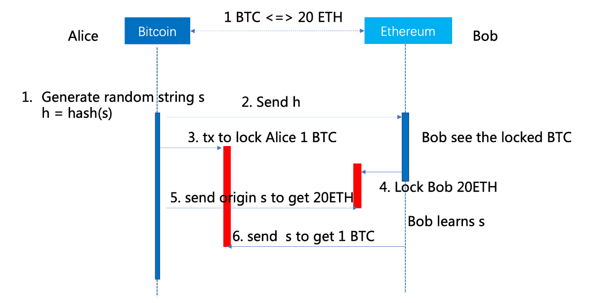
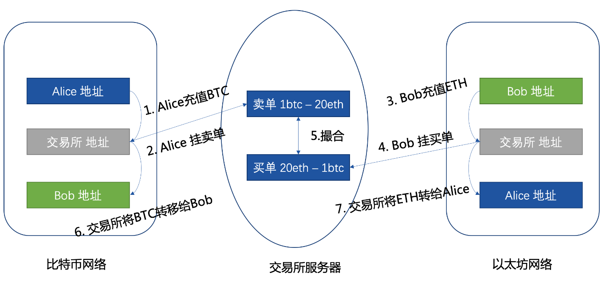
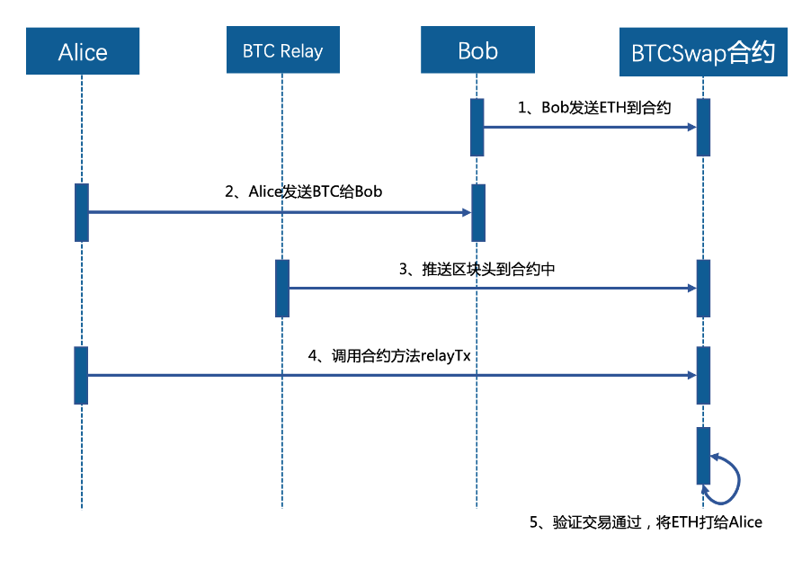
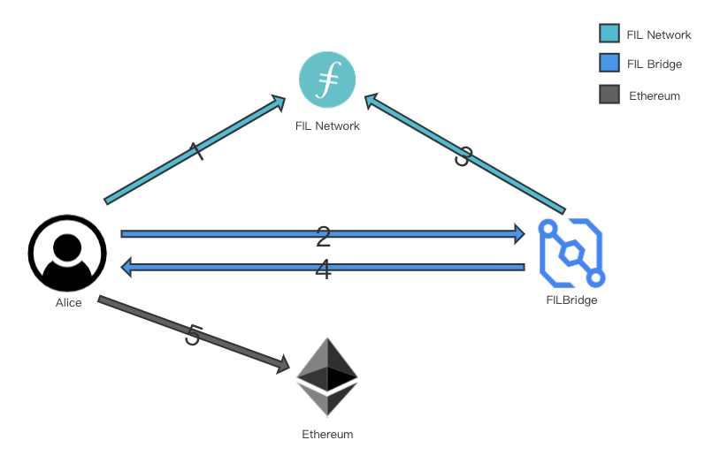
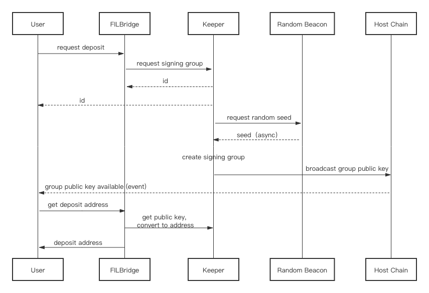
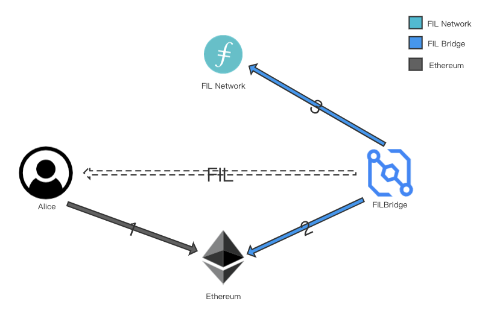

# 背景介绍
随着 Defi 的兴起，链上资产的应用场景、应用范围和流动性都有不同程度的加强，以太坊链上的 DEX、借贷、合成资产等场景给以太坊生态带来的极大的繁荣。

Filecoin 当前不支持智能合约，因此无法在链上实现DeFi，极大地限制了其发展。官方已经将[支持EVM](https://filecoin.io/blog/posts/building-web3-filecoin-ethereum-better-together/)列入计划，但开发上线和生态的发展都需要一定的时间；且现今并没有一个完备的 Filecoin 跨链技术能够将 Filecoin 及存储功能引入到如 Ethereum 等带有智能合约功能的链上，这也极大地制约了 Filecoin 参与 Defi 生态，也无法将 Filecoin 的存储空间开放给其他公链使用。

# 跨链技术
基于以上背景，xFil 希望首先通过 Filecoin 跨连桥的方式将 Filecoin 桥接到智能合约目标链（如 ETH, BSC 等）上，首先实现 Fil 参与到广阔的 Defi 生态中。

在其他公链上，已经有许多尝试在区块链之间实现各种形式的互操作性，其中大部分都集中在比特币和以太坊之间的交互上。在本节中，我们将讨论一些已提出的现有解决方案并查看它们的主要缺点。

## 哈希锁定（Hash-locking） 


Hash Locking 使用特殊的比特币脚本和以太坊合约来保证 BTC 完全或根本不交换 ETH/ERC20。哈希锁定技术主要是支持跨链中的原子资产交换，最早起源自比特币的闪电网络。其典型实现是哈希时间锁定合约HTLC(Hashed TimeLock Contract)。哈希锁定的原理是通过时间差和隐藏哈希值来达到资产的原子交换。尽管哈希锁定具有许多理想的特性，但它们有两个主要缺点：
1. 并非普遍适用。哈希锁定仅可用于交换，并且 Alice 和 Bob 必须已经就资产和价格点达成一致。这使得它们在可以使用的地方非常有限。我们不能使用原子互换来创建跨链抵押衍生品、自动化做市商等，因此需要其他解决方案。
2. 自由选择问题。哈希锁定需要很长时间才能正常运行。Alice或Bod可以有意缓慢参与，观察市场状况，看看swap是否继续有利。市场变动总是会使其中一方不利，然后该方可以取消掉期。这使各方可以“选择”退出不利的交易。

## 公证人机制
最传统的公证人机制是基于中心化交易所（例如binance bridge）的跨链资产交换，这种跨链的方式比较单一，只支持资产的交换，如下图演示了Alice通过交易所，用比特币和Bob交换ETH的过程。 



1. Alice 通过交易所钱包将自己的比特币打入交易所地址;
2. Alice 在交易所上挂上卖单1个BTC卖出20ETH价格；
3. Bob需要将自己的ETH打入交易所的以太坊地址；
4. Bob通过交易所挂出购买比特币的单子 20ETH买一个比特币；
5. 交易所将Alice的卖单和Bob的卖单进行撮合；
6. 交易所将Alice在交易所存储的1BTC 转移给Bob的比特币地址；
7. 交易所将Bob在交易所存储的20ETH 转移给Alice的以太坊地址；

至此完成了Alice和Bob的BTC和ETH的交换（案例中省去了交易所的服务费）。通过该例子可以看出交易所的方式目前仅能够支持资产的交换，且资产交换的原子性、安全性完全由中心化的交易所保障存在较大的中心化风险。

## 轻节点式侧链
侧链是相对于主链而言的，最初的侧链提出是针对比特币做新特性的测试和研发。侧链相对主链而言能够验证和解析主链中的区块数据和账本数据。侧链实现的基础技术是双向锚定（Two-way Peg），通过双向锚定技术可以将数字资产在主链上进行锁定，同时将等价的资产在侧链中释放。相反当侧链中相关资产进行锁定时，主链上锚定的等价资产也可以被释放。

BTC-Relay是号称的史上第一个侧链，BTC-Relay是通过以太坊构建了一个比特币的侧面，运用以太坊的智能合约允许用户验证比特币的交易。这里我们仍然以Alice 1BTC和Bob的20ETH数字资产交换为例阐述相应原理：

1. Bob将20ETH发送到BTCSwap的合约进行冻结；(该合约只要能够确认BTC网络上Bob接收到来自Alice 1BTC就自动将20ETH转给Alice)
2. Alice 确认Bob冻结信息后，将1 BTC转给Bob比特币账户；
3. BTC Relayer将比特币区块头推送到BTCSwap合约；
4. Alice 接下来就可以调用relay tx;
5. BTCSwap合约结合tx和BTC链的区块链进行SPV验证，验证通过则将20ETH转给Alice以太坊地址。



这种跨链的实现方式简单，但是BTC Relay需要额外的信任和维护成本，且智能合约内部的数据存储会有体积膨胀的问题。但是侧链的机制相对哈希锁定而言能够提供更多的跨链交互场景，侧链以及类SPV验证的思想适合所有跨链的场景。

# xFil Bridge
基于对跨链桥技术方案的调研，参考 Filecoin 共识与机制设计，我们设计了 xFil 的 Filecoin 跨链桥方案。

## 设计目标
xFil Bridge是一个去中心化的加密资产互操作性方案：
- 互操作性：任何人都可以使用 xFIL Bridge 将任何资产以任何数量发送到目标链(ETH, BSC等)上的任何DApp。用户只需要从单链(FIL)进行单笔交易
- 安全性：通过质押、分片和连续洗牌机制，使得 xFIL Bridge 极难被攻击。即使攻击成功，xFIL Bridge 也可以恢复丢失的资金。
- 可扩展性：随着更多资产被锁定在 xFIL Bridge 的资金库中，可以通过算法调整使 xFIL Bridge 能够自动扩展其容量以满足需求。
- 用户体验：允许任何人在任何时间以任何数量铸造/销毁挂钩资产。挂钩资产的铸造/销毁最多只需要用户进行一笔交易

## 基本原理

xFIL Bridge 使用*标记化表示*模型来实现通用互操作性。同时引入了一些改进，解决了现有模型中的许多技术和经济问题。

xFIL Bridge 用去中心化的托管人取代了可信托管人的角色。这个去中心化的托管人是使用RZL MPC 算法实现的，该算法可以生成和管理 ECDSA 私钥而无需暴露它们（甚至不暴露给支持 xFIL Bridge 的机器）。这样就消除对中心化托管人的信任，从而相较于 WBTC 和 imBTC更去中心化。

xFIL Bridge 使用Bond机制和算法调整费用确保攻击永远不会有利可图，并确保如果攻击成功，它始终可以恢复一对一的挂钩。这种方法还允许 xFIL Bridge 扩展其容量以满足需求：随着更多资产被锁定在 xFIL Bridge 中，费用的算法调整允许 xFIL Bridge 自动增加其容量以锁定更多资产。

最后，xFIL Bridge 的设计充分考虑了用户体验。它允许任何人在任何时间以任何数量铸造/销毁挂钩资产。挂钩资产的铸造/销毁最多只需要用户进行一笔交易，并且可以附加应用程序数据以允许直接调用智能合约。这允许一些有趣的用例，用户永远不需要与铸造/燃烧过程交互（并且只与他们真实链上的真实资产交互），并且跨链交易可以组合/组合以跨越多个应用程序和多链。

## 节点
xFIL Bridge 由数千台独立运行的节点提供支持，需要绑定 Bond 抵押品才能运行。每个节点的质押都代表对良好行为的承诺，如果 1) 节点恶意行为或 2) 造成资产的损失，则削减该节点的Bond。

由于签名者 Bond 需要以广泛交易的资产计价以避免市场操纵，因此最明显的 Bond 选择是主链的原生代币。在 v1 版本中，以 ETH 做 Bond 的代币。随着生态系统的成熟，其他抵押品选择可能会变得可行，但代价是实现更加复杂。

如果 ETH 的价值相对于 FIL 急剧下降，那么签名者所抵押的 ETH 的美元价值可能低于他们所支持的 FIL 存款的美元价值，这意味着签名者如果试图窃取 FIL，则具有正的预期价值在存款。
为了避免这种情况，我们要求对Bond进行超额抵押。对于每个 ETH 签名者抵押，他们必须额外提供 50%，总共 150% 的抵押率。

一般而言，150% ( 3/2 * 100%) 的总超额抵押使签名者激励与系统的福利保持一致，Bond 资产相对于存款资产的价格下降最高可达33% ((1 - 2/3) * 100% )。增加这个百分比可以增加系统的健壮性，但代价是签名者的机会成本应该通过费用来补偿。

与流行的合成稳定币方案不同，xFIL Bridge 系统设计没有努力稳定 xFIL 相对于 FIL 的价值：xFIL 将由市场定价。系统需要了解的唯一价格关系是签署的 Bond 抵押品(ETH)和 FIL 之间的价格关系。

在 v1 版本中，这意味着 ETH 相对于 FIL 的价格。由于只需要一对资产的价格，xFIL Bridge将使用通用的喂价方案，建立在 MakerDAO 的 ETHFIL Medianizer 上，目前由 MakerDAO 运营。MVP 版本的喂价设计完全由以下接口指定：

```
interface PriceFeed {
    function getPrice() external view returns (uint256);
    function updatePrice(uint256 price) public;
 }
```

它主要用于计算以ETH定价的FIL存款的价值。在 Medianizer 模型中，价格由外部实体提供。

## 分片
当收到 deposit 请求时，节点被打乱成随机的非重叠组，称为 shard。每个分片使用 RZL MPC 算法生成一个秘密的 ECDSA 私钥，所有人都不知道，包括分片中的节点。如果没有 1/3+ 的节点的合作，这个秘密的 ECDSA 私钥不会被泄露，也不能用于签署交易。这使每个分片能够安全地将资产锁定在其托管中。

分片很大，至少包含一百个节点。这使得 Sybil 攻击变得困难，因为攻击者需要拥有整个网络的很大一部分才有机会破坏任何一个分片。这也使得贿赂攻击变得极其困难，需要攻击者在极少信任的情况下，在短时间内勾结大量匿名节点。

这些特性帮助 xFIL Bridge 抵御非理性对手（不关心从攻击中获利的对手）的攻击。但是，它也有助于 xFIL Bridge 在攻击可能暂时获利的时期抵御来自理性对手的攻击。无论如何，在不太可能发生的攻击成功的情况下，xFIL Bridge 始终能够恢复其一对一的挂钩。

## 费用
费用是节点为 xFIL Bridge 提供服务的主要动力。作为对他们工作的回报，节点会获得用户支付的费用作为奖励。如果用户将 FIL 从一条链转移到另一条链，节点将获得该转移可调整百分比的一小部分。也就是说，用户转移的是 FIL，节点赚取的也是 FIL。这有助于更简洁好用的用户体验。

费用根据需求通过算法进行调整。由于绑定的也是 FIL，xFIL Bridge可以使用现金流贴现模型来调整费用，使得节点绑定的 FIL 总价值始终大于 xFIL Bridge 锁定的资产总价值。这意味着，如果资产被盗，xFIL Bridge 可以削减负责的节点的 Bond，并使用削减的 Bond，通过回购和销毁相同数量的挂钩资产来恢复一对一挂钩。即使 Bond 值暂时低于锁定值，xFIL Bridge 也可以调整费用以使值恢复一致。

xFIL Bridge 的目标是一个比锁定值大 3 倍的绑定值，因为超过这个阈值攻击 xFIL Bridge 是不合理的（Bond 削减的损失大于攻击的收益）。但是，这并不是硬性限制，因为只要 Bond 值大于锁定值，xFIL Bridge 仍然可以使用其回购和销毁机制恢复挂钩。此外，在攻击成功之前不需要应用这种机制，这使得费用调整和 Bond 重新评估之间存在时间差。

## 跨链交易
xFIL Bridge 支持2种跨链交易。以 FIL-on-Ethereum 为例：
1. 将 FIL 从 FIL Network发送到以太坊（称为 lock-and-mint），
2. 将 FIL 从以太坊发送回 FIL Network（称为 burn-and-release）

### lock-and-mint
Lock-and-mint 交易是跨链交易，其中第一步由用户发起，将资产从其源链发送到主链。例如，将 FIL 从 FIL Network 发送到以太坊。

Lock-and-mint 交易之所以如此命名，是因为第一步要求用户将资产发送到 xFIL Bridge 指定的地址，从而“锁定”。除非 xFIL Bridge 可以释放资产达成共识，否则它们将保持锁定状态。在见证资产锁定后，xFIL Bridge 向用户返回一个“铸币签名”。这授权用户在主链上铸造资产的代币化表示。该表示与锁定资产一一挂钩；它始终可以随时以任何数量兑换。

例如，Alice 可以将0.55 FIL 锁定到 xFIL Bridge，然后在以太坊上铸造相同数量的 xFIL。



1. Alice 进行了一笔 FIL Network交易，将 0.55 FIL 锁定在 FILBridge 的托管地址中。
2. Alice（或应用程序）将此交易通知 xFIL Bridge。
3. xFIL Bridge 验证 FIL Network交易的存在、细节和确认数量。
4. xFIL Bridge 使用 RZL MPC 算法生成铸造签名并将其返回给 Alice。
5. Alice（或应用程序）将铸造签名提交给以太坊铸造合约，铸造 0.54940005 xFIL（0.55 FIL - 费用）。

如上所述，Alice 只需要一笔交易——第一步中的初始 FIL Network 交易。其他一切都可以由第三方处理。虽然这里没有讨论，但 Alice 可以将特定于应用程序的数据附加到她的跨链交易中，最后一步可以导致智能合约被调用。正是这种在第5步直接调用智能合约的能力，允许第三方 DApp 代表她提交交易。这样的话 Alice 永远不需要 ETH 来支付 gas 费用，甚至不需要她自己的以太坊地址。

## 签名者选择
一旦收到存款请求，就会通过随机选择一组签名者来支持 FIL 钱包来创建签名组。这是一个多部分过程，如下图所示。



当请求创建签名组时，xFil Bridge 系统会从安全的分布式随机信标请求随机种子。[ 2 ]产生的随机种子用于从合格的签名者池中随机选择签名组成员。最后，这些签名者协调一个分布式密钥生成协议，该协议为该组生成一个公共 ECDSA 密钥，该密钥用于生成一个钱包地址，然后将其发布到主链。这样就完成了签名者选择阶段。

## burn和release
销毁和释放交易是对锁定和铸造交易的补充，允许用户和智能合约将资产从主链发送回其原始链。第一步，由用户或智能合约发起，从主链上销毁挂钩资产，并指定一个它希望接收源链上的底层资产的地址。例如，将 FIL 从以太坊发送回 FIL Network 是一种销毁和释放交易。

我们将这种交易称为“burn”交易，因为主链“烧掉”了挂钩资产，而 xFIL Bridge 在监听到 burn 事件后，“release” 源链上等量的资产。burn 事件指定了接收地址。



1. Alice（或智能合约）在以太坊上燃烧 0.2 xFIL，同时指定她的 FIL Network接收地址。
2. xFIL Bridge 监听burn事件并等待所需数量的确认（不需要手动通知 xFIL Bridge）。
3. xFIL Bridge 生成一个 FIL Network 上的交易并签名，将 0.19975 FIL（0.2 xFIL - 费用）转移到 Alice 在第一步指定的 FIL Network 地址。

与 lock-and-mint 交易一样，Alice 只需要在第一步中发起一个交易。其他一切都由 xFIL Bridge 处理。初始销毁交易也可以由智能合约触发。通过这种方式，就像锁定和铸造交易一样，第三方 DApp 能够代表她进行交易。这样的话 Alice 也不需要支付 ETH 作为 gas。